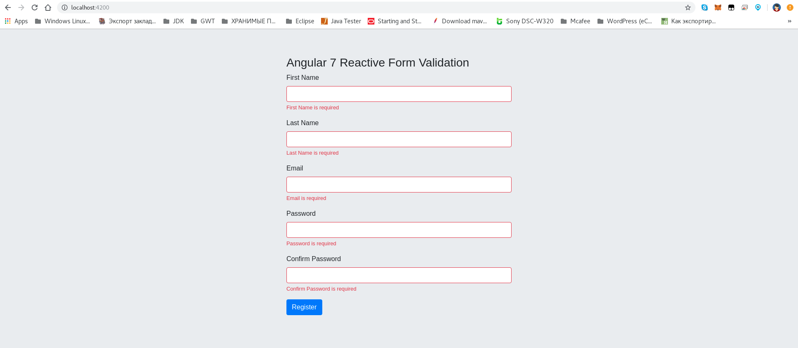
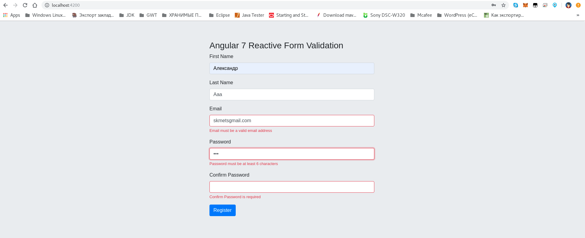
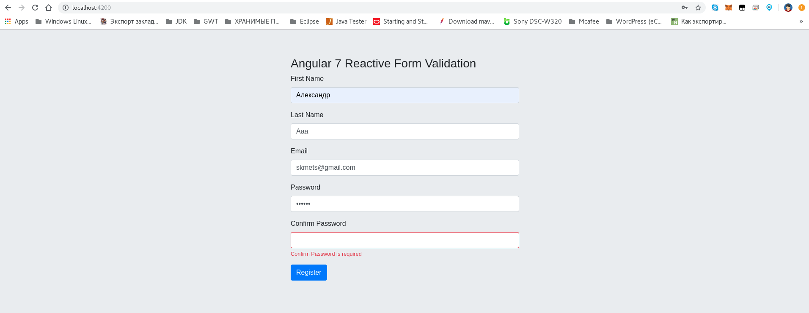
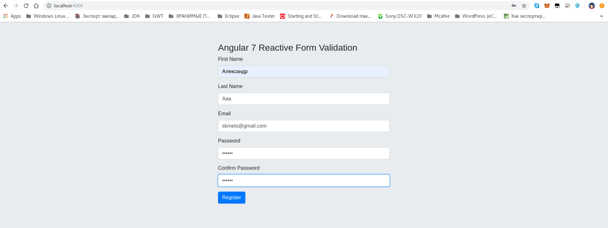
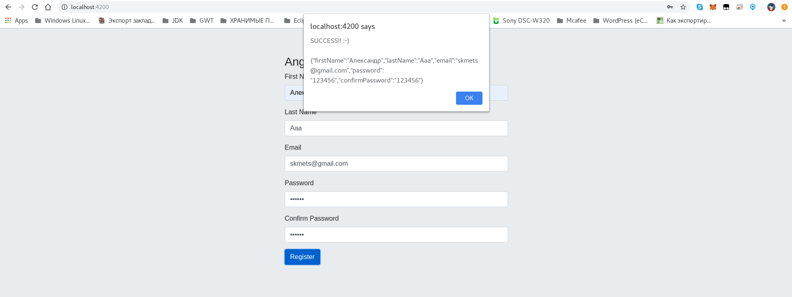

#Reactive Forms Validation App Component

* [tutorial](https://jasonwatmore.com/post/2018/11/07/angular-7-reactive-forms-validation-example)
* [repo](https://stackblitz.com/edit/angular-7-reactive-form-validation)

